# Awesome Device Intelligence Platform 🛡️

  
  
  
  
  
  

## 🚀 Top Device Intelligence & Fraud Prevention Ecosystem

**Curated List of SaaS Products & Open-Source GitHub Projects**  
*Focused on Device Fingerprinting 🔍, Bot Detection 🤖, Account Takeover (ATO) Mitigation 🔒 & Fraud Signal Enrichment ⚡*  
**Last updated: October 2026**

---

### 💡 Overview & SEO Keyword Focus
This repository tracks notable **SaaS platforms** and **open-source projects** for **Device Intelligence**, **Browser Fingerprinting**, **Mobile Device Identification**, and **Behavioral Risk Scoring**. These security tools identify and risk-score devices interacting with web and mobile applications to prevent bot attacks, credential stuffing, multi-accounting, and transaction fraud without relying on third-party cookies or persistent storage identifiers.

**Key Use Cases:**
- 🛡️ **Fraud Detection & Prevention (FDP)**: Account Takeover (ATO), Payment Fraud, Bonus Abuse, SMS Pumping.
- 🤖 **Bot Mitigation & Detection**: Headless Browsers, Emulator Detection, Residential Proxy Screening, AI Agent Activity.
- 📱 **Mobile & Web Fingerprinting**: Canvas/WebGL Fingerprinting, OS Kernel Probing, Network Velocity Signals.

---

## 📑 Table of Contents
- [🏢 SaaS/Hosted Platforms](#-saashosted-platforms)
- [⚡ Open-Source GitHub Projects](#-open-source-github-projects)
- [🤝 How to Contribute](#-how-to-contribute)
- [⚠️ Disclaimer](#️-disclaimer)
- [📈 Star History](#-star-history)

---

## 🏢 SaaS/Hosted Platforms

> **📊 Market Landscape & Size Note**: The global Fraud Detection and Prevention (FDP) & Device Intelligence market is estimated at **$55B – $70B (2026)** and projected to exceed **$150B+ by 2030**. The sector is currently **moderately fragmented**—featuring enterprise infrastructure conglomerates alongside nimble, specialized AI-driven identity & bot detection platforms, rather than a single "winner-take-all" monopoly.

| Product | Description | Starting Price | Free Tier / Trial Limit | Company Size (Valuation / Revenue) |
|---|---|---|---|---|
| **[ThreatMetrix (LexisNexis)](https://risk.lexisnexis.com/)** 🏢 | Enterprise device intelligence platform with SmartID and ExactID persistent markers. Personas system detects consistent attribute combinations over time windows. | £0.01 per transaction (Enterprise custom contract) | Tailored demo & enterprise sandbox testing (No self-serve free trial) | ~$67B / $5.6T INR (Parent RELX Market Cap) |
| **[iovation (TransUnion)](https://www.iovation.com/)** 🛡️ | Device reputation service exposing computer history of fraud without PII. Manages 180M+ unique device reputations across an inter-industry subscriber network. | Enterprise quote-based pricing | Sales-assisted demo / trial environment on request | ~$13.5B (Parent TransUnion Market Cap) |
| **[Socure Sigma](https://www.socure.com/)** ⚡ | Identity fraud solution leveraging Network Identity Graph connecting 2,800+ orgs. Entity Profiler fuses digital footprints and session intelligence. | $0.80 per evaluation (Pay-as-you-go via Socure Launch) | Developer sandbox with test credits upon registration | $5.2B Valuation ($364M ARR) |
| **[Incode Device Intelligence](https://incode.com/)** 🔐 | Device intelligence module within Incode identity platform. Generates fingerprint hash from userAgent, WebGL, canvas, adBlock, and device signals. | Volume-based enterprise tier ($100k+ verifications/yr contract) | Enterprise Proof of Concept (POC) pilot on request | $1.25B Valuation ($170M ARR) |
| **[Telesign](https://www.telesign.com/)** 📲 | Phone-centric identity platform. Score product assigns fraud risk scores (0-1000) and PhoneID provides subscriber & carrier information. | Pay-as-you-go per-request rate (No monthly minimum fee) | $5 complimentary test credits on free trial account | $1.3B Valuation (Parent Proximus Group) |
| **[Prove](https://www.prove.com/)** 📲 | Phone-Centric Identity™ platform leveraging mobile/telecom signals for verification and fraud prevention via binary possession check. | Recurring fee per linked CRM profile + usage fees | Developer sandbox access upon sales demo approval | $1.0B+ Valuation (Unicorn) |
| **[Ekata](https://ekata.com/)** 💳 | Identity verification API returning 70+ data signals from name, email, phone, address, and IP checks with ML confidence score. | $200/month (Pro Insight tier) | Demo & trial environment available on request | $850M Acquisition Value (Mastercard) |
| **[SEON](https://seon.io/)** 🕵️ | Full fraud prevention & AML platform wrapping device intelligence in digital footprint enrichment, transaction monitoring, and KYC workflows. | $699/month (Starter plan, includes 2,500 fraud checks) | 14-day sales-assisted free trial | $500M Valuation ($187M total funding) |
| **[Fingerprint](https://fingerprint.com/)** 🔍 | Device intelligence platform providing stable visitor IDs and 60+ real-time signals. Offers native SDKs and low-code Rules Engine. | $99/month for 20K API calls | 14-day free trial (Unlimited calls) + 1,000 free API calls/mo | $50M+ ARR ($77M total funding) |
| **[Castle](https://castle.io/)** 🏰 | Device intelligence with 99.5% fingerprinting accuracy and 0.001% collision rate. Returns device fingerprint, IP geolocation, and bot score. | $200/month for Pro plan ($200 API budget included) | $5 monthly API budget free (~1,000 Risk & Filter requests) | $37M Valuation ($11.6M total funding) |

---

## ⚡ Open-Source GitHub Projects

Below is a curated list of top open-source device fingerprinting, browser stealth, and endpoint visibility libraries, **sorted by GitHub Stars_Count (descending)**:

1. **[FingerprintJS](https://github.com/fingerprintjs/fingerprintjs)**   
   🌐 Browser device fingerprinting library with 28,500+ stars. Generates browser identifiers from HTML5 canvas, AudioContext, WebGL, font detection, and browser capabilities.

2. **[Osquery](https://github.com/osquery/osquery)**   
   💻 SQL-powered operating system instrumentation, monitoring, and analytics agent across Windows, Linux, and macOS.

3. **[Fleet](https://github.com/fleetdm/fleet)**   
   🛡️ Open-source osquery manager providing centralized endpoint visibility and device inventory management at enterprise scale.

4. **[Fingerprint Suite](https://github.com/apify/fingerprint-suite)**   
   🤖 Suite of browser fingerprint generation, header generation, and evasion tools for Puppeteer, Playwright, and web scraping.

5. **[CreepJS](https://github.com/abrahamjuliot/creepjs)**   
   🕵️ Advanced browser fingerprinting and privacy auditing tool that detects browser spoofing, lies, and bot automation.

6. **[Nothing Private](https://github.com/gautamkrishnar/nothing-private)**   
   🕶️ Proof-of-concept showing how browser fingerprinting tracks users across private / incognito browsing sessions.

7. **[BotD](https://github.com/fingerprintjs/BotD)**   
   🤖 Client-side JavaScript library for real-time bot detection and browser automation identification.

8. **[FingerprintJS Android](https://github.com/fingerprintjs/fingerprintjs-android)**   
   📱 Lightweight Android device identification library focused on OS signals and hardware attribute extraction.

9. **[TrustDevice-Android](https://github.com/trustdecision/trustdevice-android)**   
   📱 Battle-tested Android device fingerprinting SDK for deviceID generation, emulator detection, and root detection.

10. **[TrustDevice-JS](https://github.com/trustdecision/trustdevice-js)**   
    🌐 Browser device fingerprinting library designed for web applications and risk identification.

11. **[TrustDevice-iOS](https://github.com/trustdecision/trustdevice-ios)**   
    🍎 Open-source iOS device fingerprinting SDK for jailbreak detection and device signal scoring.

12. **[FingerprintJS iOS](https://github.com/fingerprintjs/fingerprintjs-ios)**   
    🍎 iOS device identification library extracting stable device signals on Apple mobile hardware.

---

## 🛠️ Custom Device Intelligence Architecture
**Building a custom stack?**  
Combine **TrustDevice** / **FingerprintJS** SDKs for frontend cross-platform device fingerprinting (Android, iOS, Web) with **Osquery** / **Fleet** for endpoint OS threat hunting. Note that full commercial-grade device intelligence with global consortium reputation networks, real-time risk verdicts, and machine-learning bot models remains primarily proprietary.

---

## 🤝 How to Contribute

1. 🍴 Fork the repository.
2. 📝 Add/edit entries in `README.md` (following the existing table / list format).
3. 🔗 Include: name, official site/repo link, 1–2 sentence description, and pricing/star metadata.
4. 🚀 Submit a PR with a short explanation.

---

## ⚠️ Disclaimer

- This is a **community-curated** resource list—not exhaustive and not an endorsement.
- Device intelligence tools collect sensitive hardware and behavioral telemetry. Self-hosted and custom solutions require proper security hardening and compliance with global data privacy regulations (GDPR, CCPA). Fraud prevention is explicitly recognized as a legitimate interest under GDPR Recital 47.
- Fingerprinting accuracy varies depending on browser privacy settings, VPN/Tor usage, and ad-blockers.

---

## 💖 Support & Acknowledgments

Thank you for visiting and supporting the **Awesome Device Intelligence Platform** repository! 🙏

If you find this curated ecosystem list helpful for your research, security engineering, or fraud prevention stack, please consider supporting the project:

- ⭐ **Star** this repository to help others discover it on GitHub.
- 🍴 **Fork** it to keep your own reference copy or contribute new tools.
- 📢 **Share** it with your network, team, security architects, and risk engineers!
- ☕ **Buy Me a Coffee / Sponsor**: If you'd like to support ongoing open-source curation and maintenance, feel free to sponsor via [GitHub Sponsors](https://github.com/sponsors/ishandutta2007)!

---

## 📈 Star History

---

**Made for fraud prevention analysts 🕵️, identity verification teams 🔐, risk engineers ⚡, and security architects 🛡️.**  
*Awesome-Awesome-Awesome repository reference: [Awesome-Awesome-Awesome](https://github.com/ishandutta2007/Awesome-Awesome-Awesome)*

## Star History

<a href="https://star-history.com/#ishandutta2007/Awesome-Device-Intelligence-Platform&Timeline" align="center">
  <picture>
    <source media="(prefers-color-scheme: dark)" srcset="assets/ishandutta2007_Awesome-Device-Intelligence-Platform_growth.svg">
    
  </picture>
</a>
