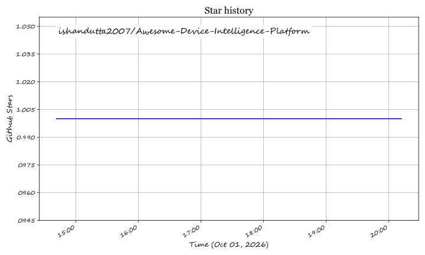

# Awesome-Device-Intelligence-Platform

Top Device Intelligence Platform EcosystemCurated List of SaaS Products & Open-Source GitHub ProjectsFocused on Device Fingerprinting, Bot Detection & Fraud Signal EnrichmentLast updated: October 2026This repository tracks notable SaaS platforms and open-source projects for Device Intelligence. These tools identify and risk-score devices interacting with web and mobile applications to detect fraud, account takeover, bot activity, and multi-accounting without relying on cookies or persistent identifiers.Examples include Fingerprint, Castle, SEON, Telesign, ThreatMetrix (LexisNexis), iovation, Ekata, Prove, Incode Device Intelligence, and Socure Sigma (the category leaders).Open-source emphasis: The open-source ecosystem for device intelligence is anchored by TrustDevice (battle-tested device fingerprinting SDKs for Android, iOS, and web), with strong coverage in browser fingerprinting libraries and behavioral analysis tools. Note that full commercial-grade device intelligence with consortium networks and real-time risk verdicts remains largely proprietary.Contributions welcome! Open a PR to add/update entries. Keep descriptions factual and link to official sites.Table of ContentsSaaS/Hosted PlatformsOpen-Source GitHub ProjectsHow to ContributeDisclaimerSaaS/Hosted PlatformsFingerprintDevice intelligence platform providing stable visitor IDs and 60+ real-time signals for fraud prevention, personalization, and SMS pumping prevention -1-14. Provides native SDKs for Android, iOS, React Native, and Flutter -14. Offers no-code deployment via Cloudflare edge wizard and a low-code Rules Engine for if-this-then-that enforcement -1. Entry pricing at $99/month for 20K API calls with a free tier -2.CastleDevice intelligence and fraud prevention platform with 99.5% fingerprinting accuracy and a 0.001% collision rate optimized for account security scenarios -3. Stealth fingerprinting technology bypasses ad blockers and privacy plugins for 100% coverage -3. Returns device fingerprint, user agent, IP geolocation, proxy/VPN/Tor status, carrier, and bot score (0-100) with 150ms API response time -3. Starting at $0 for 1,000 requests/month -3.SEONFull fraud prevention and AML compliance platform that wraps device intelligence in digital footprint enrichment, transaction monitoring, and KYC workflows -4-18. Detects emulators, VPNs, residential proxies, remote access tools, AI agents, and device farms by correlating behavioral patterns (typing, mouse movement) with device and network signals -4. Processes 15M+ fraud checks daily and has prevented $300B+ in attempted fraud -18. Clients include Wise, Plaid, and Revolut -18.TelesignPhone-centric identity and fraud detection platform. The Score product receives a phone number and assigns a fraud risk score from 0 to 1000, with thresholds triggering action responses (block/allow) -19. PhoneID provides carrier, line type, and subscriber information for identity verification and risk assessment -19.ThreatMetrix (LexisNexis)Enterprise device intelligence platform with SmartID (device attributes) and ExactID (persistent markers including cookies, Flash LSO, HTML5 storage) -6. Digital ID uses probabilistic matching with confidence scores (0-10000) to link events to identities -6. Personas system detects consistent attribute combinations over time windows (e.g., name+address seen 3+ times over 3 months) -6.iovation (TransUnion)Device reputation service that exposes a computer's history of fraud and abuse without requiring personally identifiable information -7. Has performed 4B+ device reputation checks, manages 180M+ unique device reputations, and stops 11M+ fraudulent activities annually -7. Subscribers share a network of device reputations across multiple industries -7.EkataIdentity verification API returning 70+ data signals from name, email, phone, address, and IP checks -8. Provides a Confidence Score derived from identity network patterns and machine learning -8. Checks include email-to-name match, address-to-name match, phone-to-name match, IP risk flag, and distance-to-address calculations -8.ProvePhone-Centric Identity™ platform that leverages mobile, telecom, and other signals for identity verification and fraud prevention -9. Uses phone line tenure, behavior (calls, texts, logins), change events (ports, SIM swaps), and velocity as high-depth, high-consistency signals correlated with digital trust -9. Provides a binary "possession" check via the mobile device as a "what you have" factor -9.Incode Device IntelligenceDevice intelligence module within Incode's identity verification platform. Fetches device info during onboarding including IP address, device type, geolocation, and a fingerprint hash generated from userAgent, webdriver, language, screen resolution, timezone, canvas, WebGL, adBlock detection, and touch support -10.Socure SigmaIdentity fraud solution leveraging the Network Identity Graph connecting 2,800+ organizations to assess identity behavior across institutions, geographies, and timeframes -11. Entity Profiler fuses digital footprints and session intelligence with authoritative data for a persistent device ID -11. Captures 85% of fraud in the highest 3% of risky applications (vs. industry average 37%) and 89% in the highest 5% -11.Open-Source GitHub ProjectsTrustDevice-AndroidLeading open-source Android device fingerprinting SDK for accurate deviceID and risk identification, with 373+ stars -12. Kotlin-based with active maintenance -12. Part of the TrustDevice suite from TrustDecision -12.TrustDevice-JSLeading open-source browser device fingerprinting library for accurate deviceID and risk identification, with 259+ stars -12. JavaScript-based with 235KB size -12.TrustDevice-iOSLeading open-source iOS device fingerprinting SDK for accurate deviceID and risk identification, with 216+ stars -12. Objective-C-based -12.Additional Strong Open-Source OptionsOsquery — Open-source agent for inspecting operating system internals across Windows, Linux, and macOS. Queries running processes, network sockets, logged-in users, and file system changes via SQL. Lightweight and scalable to hundreds of thousands of devices -13.Fleet — Open-source osquery manager providing a single source of truth for endpoint visibility at scale -13.Frameworks for building custom device intelligence solutions: Combine TrustDevice SDKs for cross-platform device fingerprinting (Android, iOS, web) with Osquery for endpoint-level device inventory and threat hunting. Note that true commercial-grade device intelligence with consortium networks, real-time risk verdicts, and behavioral ML models remains primarily proprietary. Open-source stacks provide strong fingerprinting primitives and endpoint visibility foundations that require integration for complete fraud detection pipelines.How to ContributeFork the repo.Add/edit entries in README.md (follow existing format).Include: name, link, 1–2 sentence description, and whether it's SaaS or open-source.Submit PR with a short explanation.Star the repo if you find it useful!DisclaimerThis is a community-curated list — not exhaustive and not an endorsement.Device intelligence tools collect sensitive device and behavioral data. Self-hosted solutions require proper security hardening and compliance with data privacy regulations (GDPR, CCPA). Fraud prevention is recognized as a legitimate interest under GDPR Recital 47 -14.Fingerprinting accuracy varies by device type, browser privacy settings, and ad blocker usage. Commercial platforms provide consortium networks and real-time enrichment that open-source libraries cannot replicate.The open-source ecosystem provides strong fingerprinting primitives and endpoint visibility foundations, but consortium device reputation, behavioral ML models, and real-time risk verdicts remain primarily commercial offerings.Made for fraud prevention analysts, identity verification teams, risk engineers, and security architects.Let's make device intelligence more open, transparent, and privacy-respecting.

## Star History

<a href="https://star-history.com/#ishandutta2007/Awesome-Device-Intelligence-Platform&Timeline" align="center">
  <picture>
    <source media="(prefers-color-scheme: dark)" srcset="assets/ishandutta2007_Awesome-Device-Intelligence-Platform_growth.svg">
    
  </picture>
</a>
